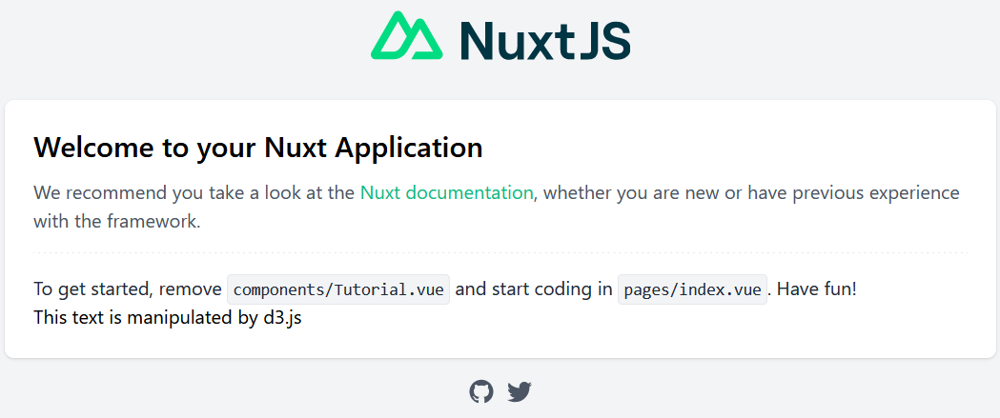

# nuxtjs-d3js-example

## Screenshot



Please note that the `This text is manipulated by d3.js` portion verifies that d3.js is correctly working.

## Run

```sh
cd nuxtjs-d3js-example
npm install
npm run dev
```

If you encountered `ERR_OSSL_EVP_UNSUPPORTED` error, use the following to suppress the error [(reference)](https://stackoverflow.com/a/69746937):

```sh
export NODE_OPTIONS=--openssl-legacy-provider
npm run dev
```

## Adding D3JS on New/Existing NuxtJS Project

1. Create a new NuxtJS project (Skip this step if you have an existing project) [[Git diff]](https://github.com/j3soon/nuxtjs-d3js-example/commit/a576746dd1a5f8ddf2b43a8bf3347949a32a435b)
   ```sh
   npm init nuxt-app nuxtjs-d3js-example
   ```
2. Install D3JS ([reference](https://github.com/swimlane/ngx-charts/issues/1686)) [[Git diff]](https://github.com/j3soon/nuxtjs-d3js-example/commit/f6dd66baa1e029e01b7ad26ea46524486426d195)
   ```sh
   npm install d3
   npm install @types/d3 --save-dev
   ```
3. Import D3JS and add a target [[Git diff]](https://github.com/j3soon/nuxtjs-d3js-example/commit/39af42ac207d5837adcfbafccb2861b73e5ecd55)

   HTML:
   ```html
   <p id="d3-target"></p>
   ```

   JavaScript:
   ```js
   import * as d3 from 'd3'
   export default {
     name: 'NuxtTutorial',
     mounted: function() {
       d3.select("#d3-target").text("This text is manipulated by d3.js")
     },
   }
   ```
4. Fix ES Module error ([reference-1](https://stackoverflow.com/a/69470924), [reference-2](https://github.com/nuxt/nuxt.js/issues/9223#issuecomment-840747064)) [[Git diff]](https://github.com/j3soon/nuxtjs-d3js-example/commit/873439c49f55676b32f78e1c87a8309637e4e6c2)

   Error:
   ```
   require() of ES Module /home/johnson/projects/nuxtjs-d3js-example/nuxtjs-d3js-example/node_modules/d3/src/index.js from /home/johnson/projects/nuxtjs-d3js-example/nuxtjs-d3js-example/node_modules/vue-server-renderer/build.dev.js not supported. Instead change the require of index.js in /home/johnson/projects/nuxtjs-d3js-example/nuxtjs-d3js-example/node_modules/vue-server-renderer/build.dev.js to a dynamic import() which is available in all CommonJS modules. 
   ```

   `nuxt.config.js`:
   ```js
   build: {
     standalone: true,
   }
   ```

All modification details can be found in the [Git commit history](https://github.com/j3soon/nuxtjs-d3js-example/commits/master).